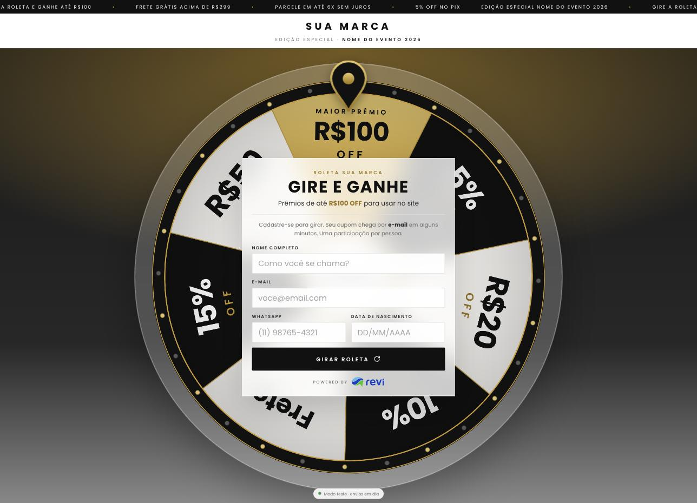

# Roleta de cupons integrada à Revi

Modelo sem marca de uma roleta "gire e ganhe" para estandes e eventos: a pessoa se cadastra no totem, gira e
ganha um cupom, que a [Revi](https://userevi.com) envia por e-mail ou WhatsApp. Feito para totem vertical, tablet
e celular, sem rolagem e sem build.



- Cadastro com nome, e-mail, WhatsApp e nascimento, com máscara, validação e sugestão de domínio de e-mail.
- Sorteio ponderado, com a roleta sempre parando na fatia sorteada.
- **Um único webhook** da Revi ("Atualização de dados de cliente"), chamado **uma vez, só no giro**.
- O secret do webhook fica no servidor (função da Vercel), nunca na página.
- Modo totem: volta sozinha para o cadastro, limpa cadastro abandonado, uma participação por pessoa no aparelho,
  CSV de backup.

## Com o Claude Code (recomendado)

O projeto traz a skill **`roleta-revi`**, que faz o processo inteiro com você: pega logo, cores e fonte do site
da marca, configura prêmios e cupons, pede a URL e o secret do webhook, envia o primeiro payload de teste,
orienta a configuração do webhook e da automação na Revi, gera o template de e-mail ou de WhatsApp e publica na
Vercel. Se você quiser, o Claude assume o navegador com a sua conta da Revi logada e faz a configuração por você.

1. Instale a skill (uma vez):

   ```bash
   git clone https://github.com/allan649/roleta-revi.git
   mkdir -p ~/.claude/skills && cp -r roleta-revi/.claude/skills/roleta-revi ~/.claude/skills/
   ```

   (Abrindo o Claude Code dentro da pasta clonada, a skill já está disponível sem instalar.)

2. Abra o Claude Code numa pasta de trabalho e peça:

   > Quero montar a roleta de cupons da marca X para o evento Y. O site é https://...

3. Tenha em mãos: acesso à conta da marca na Revi, os códigos dos cupons (criados na loja) e uma conta na
   Vercel. Para a configuração pelo navegador, o Claude in Chrome precisa estar instalado e a Revi logada.

## Sem o Claude

Siga o [PASSO-A-PASSO.md](PASSO-A-PASSO.md): marca, prêmios, webhook, primeiro payload, template, disparo,
deploy e operação no evento.

Para testar no computador (Node.js 20.11+):

```bash
cp .env.example .env    # URL e secret do webhook
node --env-file=.env dev.mjs
# http://127.0.0.1:8765/?teste=1
```

## Arquivos

| Arquivo | O que é |
|---|---|
| `index.html` | a roleta; toda a configuração fica em `CONFIG`, `TEMA` e `PREMIOS`, no topo do script |
| `api/cadastro.mjs` | função da Vercel que repassa o envio à Revi com o header `x-revi-secret` |
| `dev.mjs` | servidor local que roda a página e a função com o `.env` |
| `scripts/enviar-payload.mjs` | envia o primeiro payload de teste, com o seu contato |
| `payload-exemplo.json` | o JSON que a página envia (use em "Simular payload" na Revi) |
| `templates/email.html` | bloco HTML do e-mail com o cupom, para o editor da Revi |
| `templates/whatsapp.md` | modelos de template de WhatsApp (Marketing com cupom, Utility de confirmação) |
| `.claude/skills/roleta-revi/` | a skill do Claude Code |
| `.env.example` | as duas variáveis: `REVI_WEBHOOK_URL` e `REVI_WEBHOOK_SECRET` |

## Segurança

- O `.env` está no `.gitignore`. Na Vercel, a URL e o secret ficam em Environment Variables.
- Teste sempre com o seu próprio contato: com a automação ativa, a Revi envia o template para quem está no payload.
- Não há fila de reenvio: se um envio falhar, o rodapé fica vermelho e o `?exportar=1` tem todas as participações.
